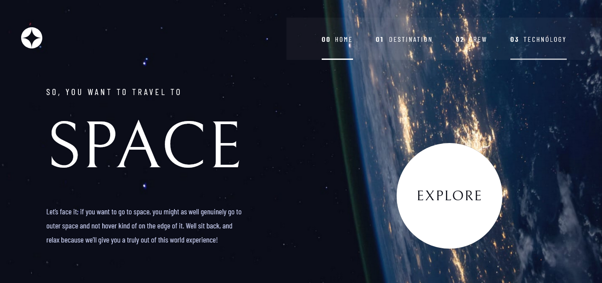
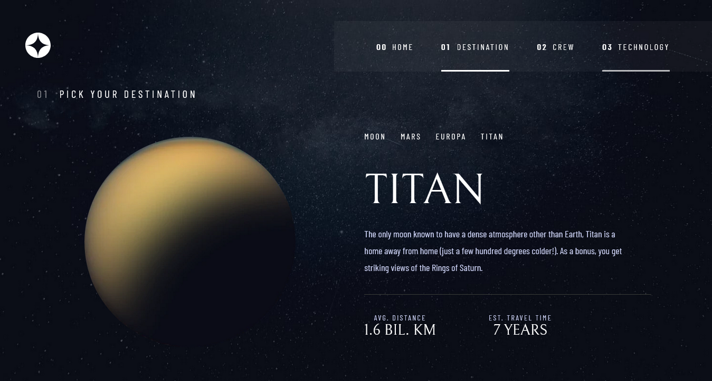
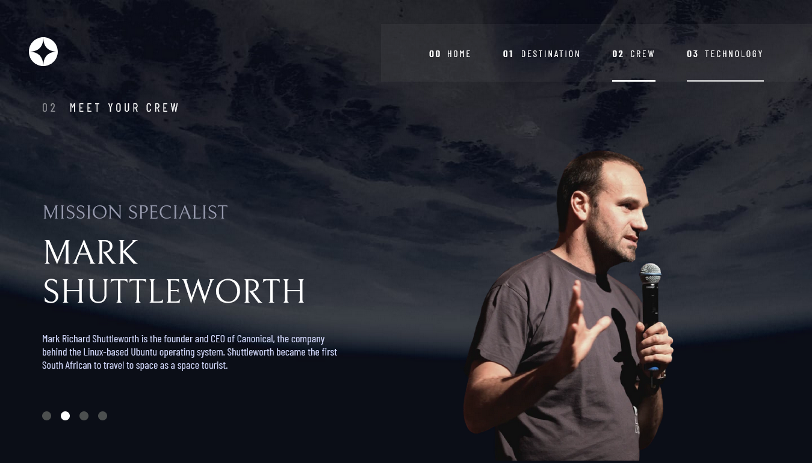

# Frontend Mentor - Space tourism website solution

This is a solution to the [Space tourism website challenge on Frontend Mentor](https://www.frontendmentor.io/challenges/space-tourism-multipage-website-gRWj1URZ3).
## Table of contents

- [Overview](#overview)
  - [The challenge](#the-challenge)
  - [Screenshot](#screenshot)
  - [Links](#links)
- [My process](#my-process)
  - [Built with](#built-with)
  - [What I learned](#what-i-learned)
  - [Continued development](#continued-development)
  - [Useful resources](#useful-resources)
- [Author](#author)
- [Acknowledgments](#acknowledgments)

## Overview

### The challenge

Users should be able to:

- View the optimal layout for each of the website's pages depending on their device's screen size
- See hover states for all interactive elements on the page
- View each page and be able to toggle between the tabs to see new information

### Screenshot

 

 

 

### Links

- Solution URL: [Front end mentor](https://www.frontendmentor.io/solutions/responsive-multiepage-space-tourism-website-SJuxRxoV5)
- Live Site URL: [Space Tourism](https://romario-negreiros.github.io/Space-Tourism/)

## My process

### Built with

- HTML
- CSS
- SASS
- Javascript
- Mobile first
- BEM pattern

### What I practiced

- Mobile first workflow
- I hadn't use SASS in a while, this project helped me to remember the syntax and how to use SASS,
also how to learn how to create animations with it
- Structuring html content with semantic tags
- Writing readable (i hope) code with javascript, and make use of modules to divide functions reponsabilities.

### Useful resources

[How to create animations with SASS](https://glennmccomb.com/articles/creating-smooth-sequential-animations-with-sass/)

## Author

- Website - [Romario Negreiros](https://romario-negreiros.github.io/Romario-frontend/)
- Frontend Mentor - [@Romario-Negreiros](https://www.frontendmentor.io/profile/Romario-Negreiros)

## Acknowledgments

- Thanks to Glenn McComb, who wrote the post about animations in SASS.

